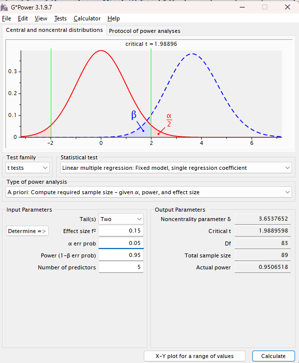

```{r setup, include=FALSE}
knitr::opts_chunk$set(echo = TRUE)
```

## Q1)

### part a)

 Response, factors, blocks, held constant factors.
 
 Response: scores of students on reading comprehension
 
 Factors: reading modality(screen or paper)
 
 Blocks: Word reading and vocabulary, two different primary schools in Norway
 
 Held constant factors: grade(tenth), texts, type of text
 
I would also perform multiple tests in different age groups and also separate by gender, because result might vary due to age group and gender could be a good blocking factor to make sure the student population being tested is uniform

### part b)

There were 72 students in the study, I don't believe that this is large enough of a sample size, the power was 0.67, meaning that there is a high probability of not being able to properly identify to reject the null. I would increases samples to get power to at least 0.80

### part c)

The author is talking about the consistency of the questionnaire, saying that because of Cronbach’s alpha is high at 0.75, then the questions used were consistently answered among all the participants


### part d)

```{r}
data1 <- read.csv("paper_vs_ereader.csv")
head(data1)
```

### part e)


## Question 2


### part a)

```{r}
baldness <- read.table("HeartDiseaseBaldness.txt", header=TRUE)
head(baldness)
```

### part b)

```{r}
dim(baldness)
```

### part c)

```{r}
colnames(baldness)
```

### part d)

H0: Early Baldness is uncorrelated with Heart Disease

HA: Early Baldness is correlated with Heart Disease

### part e)

```{r}
table(baldness$Heart_Disease, baldness$Baldness)
```

### part f)

```{r}
library(ggplot2)
ggplot(baldness, aes(x = Baldness)) + geom_bar()
ggplot(baldness, aes(x = Heart_Disease)) + geom_bar()
ggplot(baldness, aes(x = Baldness, fill = Heart_Disease)) + geom_bar()
```

### part g)

```{r}

```


## Q3)

### part a)

Social implications of wealth: Which factors predict one's income?

### part b)

Randomized Complete Block Design

### part c)


